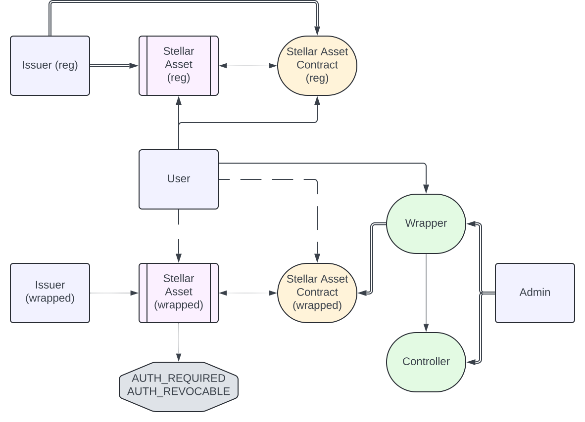

### Stellar Asset Contract wrapped playground

#### Wrapper contract
All sample contracts were taken from https://github.com/fazzatti/oi-fifo-soroban-demos

#### Assets structure

Structure diagram:

In the diagram, dots represent relations between entities, single line is allowed write/read operations, 
dashed line is readonly operations, and double line is admin relations. 

At the top of the diagram, there is a regular asset structure:
There is an `issuer (reg)` account that issues `Stellar Asset (reg)` asset, backed by `Stellar Asset Contract (reg)`.
User can do read/write operations (read their balance, and do transfers), using both classic stellar asset representation, 
and Stellar Asset Contract. Issuer controls both Stellar Asset, and the Stellar Asset Contract.

At the bottom of the diagram there is a proposed Wrapped architecture.
As before, there is an issuer, asset and asset contract. 
However, this time `Stellar Asset (wrapped)` has 2 flags set `AUTH_REQUIRED` and `AUTH_REVOCABLE`, disallowing users to 
interact with the asset directly. User can only read their balance, and can't do transactions (do any transfers). 
Issuer also doesn't admin asset contract anymore. 
Instead, it's managed by the Wrapper, which is an admin for the Stellar Asset Contract.
`Wrapper` in turn has its own admin account (`Admin`).
`Wrapper` is primarily point of communication and is called be the user in place of the 
Stellar Asset Contract for all write operations, and the contract itself implements the token interface.
Finally, the logic that manages approval of write operations is in the `Controller`. This a separate contract that 
allows asset issuer to modify logic by switching to a new contract without changing main `Wrapper` contract address. 

In the code, this entities are referred by the following names:
* `Issuer(reg)`: `regularSacIssuer`
* `Stellar Asset(reg)`: `asset`
* `Stellar Asset Contract`: `sac`
* `User`: `alice` and `bob`
* `Issuer (wrapped)`: `wrappedIssuer`
* `Stellar Asset (wrapped)`: `asset_wrapped` 
* `Stellar Asset Contract (wrapped)`: `sac_wrapped`
* `Wrapper`: `wrapper`
* `Controller`: `controller`
* `Admin`: `admin`

#### Project structure
To run the project you will need make, rust + cargo, stellar-cli and node + yarn
Project provides a makefile to work with. In order to compile contracts and typescript code, run `make`.
You can now run tests with `make test`.
Note that cli should be in `$PATH` (NOT in the shell you are currently running, e.g. test won't work if you put path to 
cli in your *rc file).
Alternatively, you can create `.env` file and set `STELLAR_CLI_PATH` to point to the cli location.
In addition, following keys can be configured for test:
* `REGULAR_ISSUER_KEY`
* `ISSUER_KEY`
* `ADMIN_KEY`
* `ALICE_KEY`
* `BOB_KEY`
* `SUBMITTER_KEY`

It is recommended to set your own keys and create accounts for them, as default test keys may not work due to testnet reset.

#### Tests
Following test cases were added:
1. Basic operations (name, mint, transfer) for both regular and wrapped asset
2. Transfer and swap of regular <-> wrapped asset via swap contract
3. Check that calling SAC wrapped directly to try transferring funds will fail 
